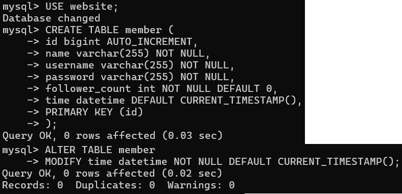
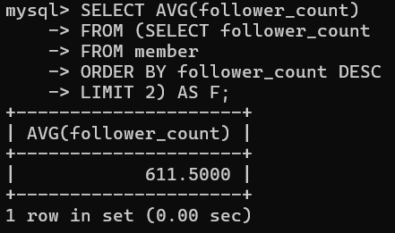

# WeHelp Week 5

## Task 2

- Create a new database named website.

        CREATE DATABASE website;

  

- Create a new table named member, in the website database.

        USE website;
        CREATE TABLE member (
            id bigint AUTO_INCREMENT,
            name varchar(255) NOT NULL,
            username varchar(255) NOT NULL,
            password varchar(255) NOT NULL,
            follower_count int NOT NULL DEFAULT 0,
            time datetime DEFAULT CURRENT_TIMESTAMP(),
            PRIMARY KEY (id)
        );
        ALTER TABLE member
        MODIFY time datetime NOT NULL;

  

## Task 3

- INSERT a new row to the member table where name, username and password must
  be set to test. INSERT additional 4 rows with arbitrary data.

        INSERT INTO member (name, username, password)
        VALUE ('test', 'test', 'test');

        INSERT INTO member (name, username, password, follower_count)
        VALUES
        ('Kinako', 'sk0410', '6666', 375),
        ('Mei', 'ym1029', '7777', 500),
        ('Shiki', 'ws0617', '8888', 430),
        ('Natsumi', 'on0807', '9999', 723);

  

- SELECT all rows from the member table.

        SELECT \* FROM member;

  

- SELECT all rows from the member table, in descending order of time.

        SELECT \* FROM member
        ORDER BY time DESC;

  

- SELECT total 3 rows, second to fourth, from the member table, in descending order
  of time.

        SELECT * FROM member
        ORDER BY time DESC
        LIMIT 3 OFFSET 1;

  

- SELECT rows where username equals to test.

        SELECT * FROM member
        WHERE username = 'test';

  

- SELECT rows where name includes the es keyword.

        SELECT * FROM member
        WHERE name LIKE '%es%';

  

- SELECT rows where both username and password equal to test.

        SELECT * FROM member
        WHERE username = 'test' AND password = 'test';

  

- UPDATE data in name column to test2 where username equals to test.

        UPDATE member
        SET name = 'test2'
        WHERE username = 'test';

  

## Task4

- SELECT how many rows from the member table.

        SELECT COUNT(\*)
        FROM member;

  

- SELECT the sum of follower_count of all the rows from the member table.

        SELECT SUM(follower_count)
        FROM member;

  

- SELECT the average of follower_count of all the rows from the member table.

        SELECT AVG(follower_count)
        FROM member;

  

- SELECT the average of follower_count of the first 2 rows, in descending order of
  follower_count, from the member table.

        SELECT AVG(follower_count)
        FROM (SELECT follower_count
        FROM member
        ORDER BY follower_count DESC
        LIMIT 2) AS F;

  

## Task5

- Create a new table named message, in the website database.

        CREATE TABLE message (
            id bigint AUTO_INCREMENT,
            member_id bigint NOT NULL,
            content varchar(255) NOT NULL,
            like_count int NOT NULL DEFAULT 0,
            time datetime NOT NULL DEFAULT CURRENT_TIMESTAMP(),
            PRIMARY KEY (id),
            FOREIGN KEY (member_id) REFERENCES member(id)
        );

  

- SELECT all messages, including sender names.

        SELECT message.\*, member.name
        FROM message
        LEFT JOIN member ON message.member_id = member.id;

  

- SELECT all messages, including sender names, where sender username equals to
  test.

        SELECT message.\*, member.name
        FROM message
        LEFT JOIN member ON message.member_id = member.id
        WHERE member.username = 'test';

  

- Use SELECT, SQL Aggregation Functions with JOIN statement, get the average like
  count of messages where sender username equals to test.

        SELECT AVG(like_count)
        FROM (SELECT message.\*, member.username
        FROM message
        LEFT JOIN member ON message.member_id = member.id) AS M
        WHERE username = 'test';

  

- Use SELECT, SQL Aggregation Functions with JOIN statement, get the average like
  count of messages GROUP BY sender username.

        SELECT username, AVG(like_count)
        FROM (SELECT message.\*, member.username
        FROM message
        LEFT JOIN member ON message.member_id = member.id) AS M
        GROUP BY username;

  
